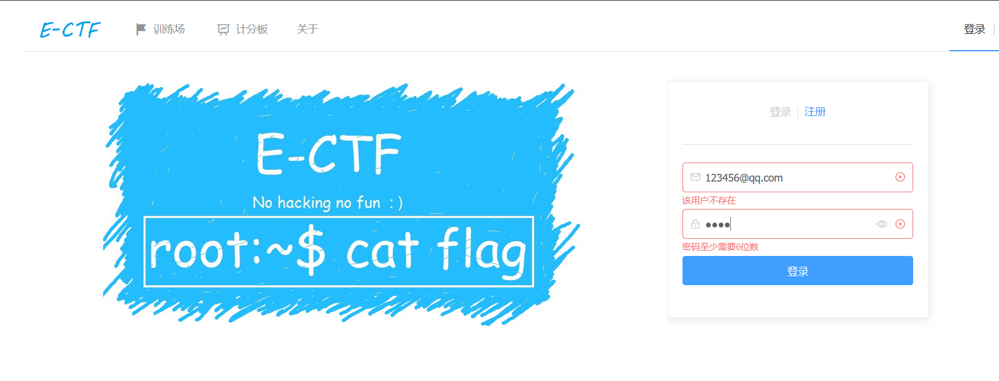
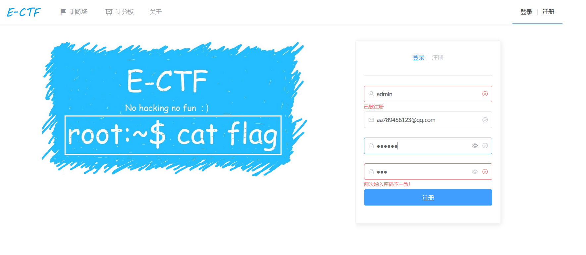
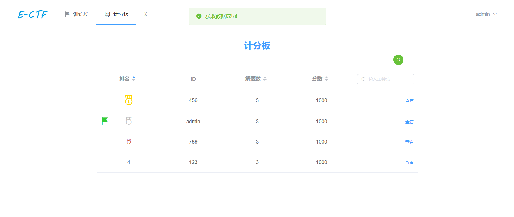
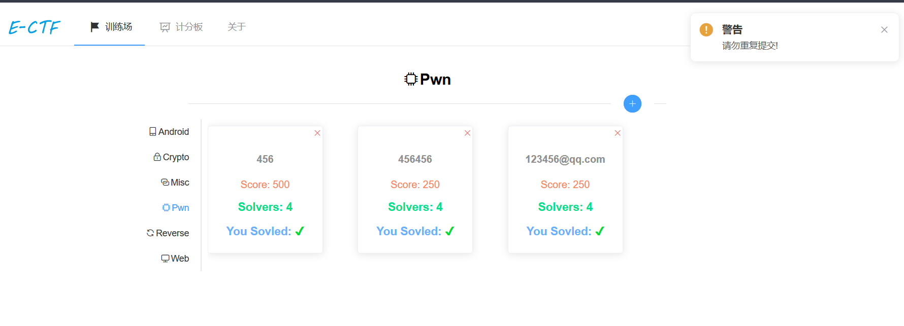
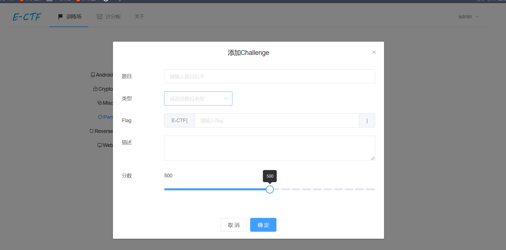
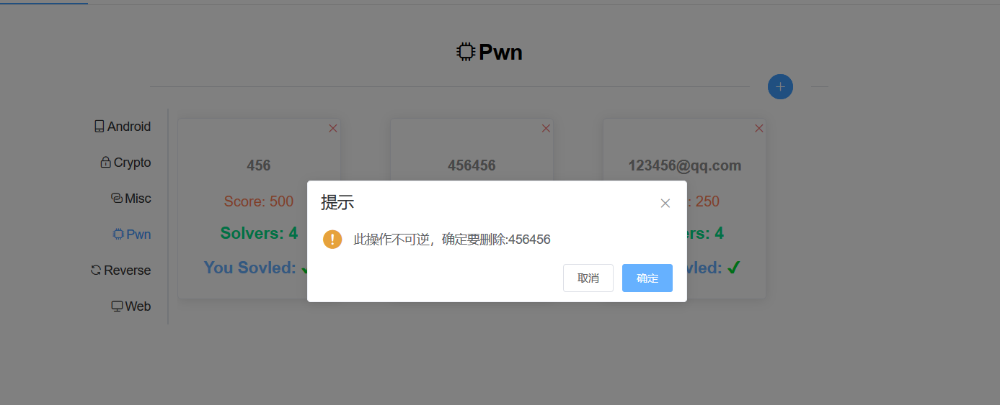
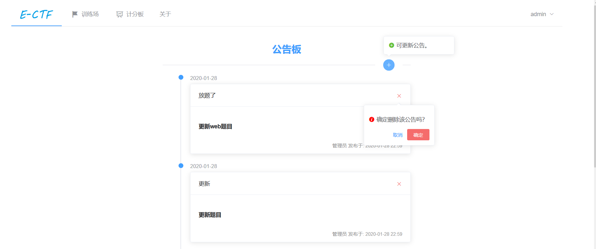
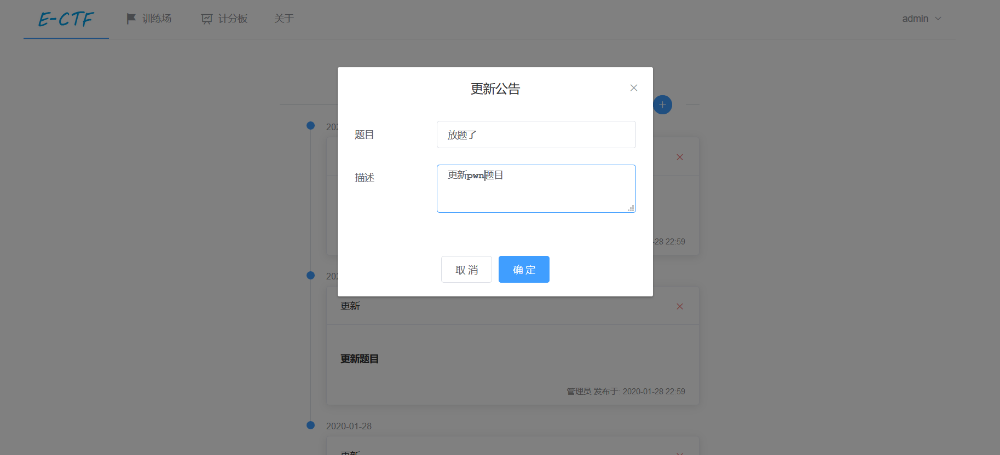

# E-CTF-VUE

## 基于VUE开发的E-CTF平台前端模板
项目实例: [E-CTF](http://39.106.85.139/index)

需要配合[API端](https://github.com/RGDZ-GZU/E-CTF-API.git)一起使用

## 效果展示:
> 还有很多细节动画效果没法展示，细节请查看项目实例

















## Project setup
```
npm install
```

### Compiles and hot-reloads for development
```
npm run serve
```

### Compiles and minifies for production
```
npm run build
```

### Lints and fixes files
```
npm run lint
```

### Customize configuration
See [Configuration Reference](https://cli.vuejs.org/config/).

## 自述
> 我只是想做一个高颜值，简约可用的靶场面板，更多功能带更新，希望各位走过路过，留个star :)